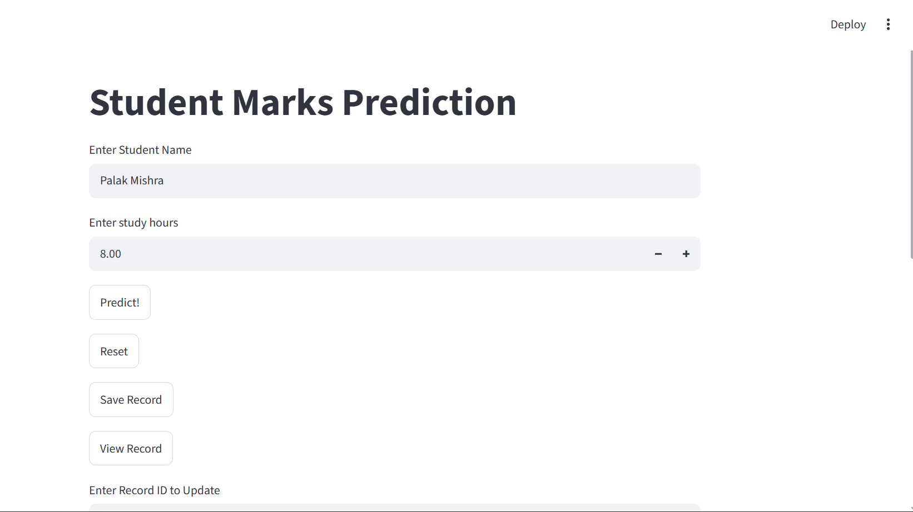
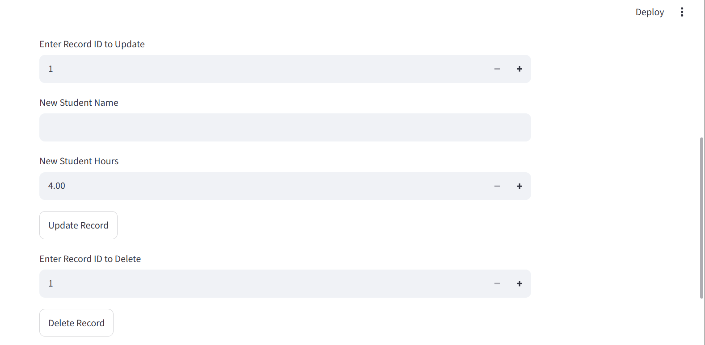

# Student-Marks-Prediction
#  Student Marks Prediction

##  Project Overview
This is a Machine Learning project that predicts student marks based on study hours using the Linear Regression algorithm.

##  Features
- Predicts student marks
- User-friendly interface
- Fast prediction
- Built using Python

##  Technologies Used
- Python
- Streamlit
- Pandas
- NumPy
- Scikit-learn
- Joblib
- SQLite

##  Project Structure
```
Student_Marks_Pred/
│── main.py
│── student_marks.pkl
│── students.db
│── requirements.txt
```

##  How to Run
1. Clone this repository.
2. Install the required libraries:
   ```
   pip install -r requirements.txt
   ```
3. Run the application:
   ```
   streamlit run main.py
   ```

##  Output
## Main Interface


## Prediction Result



## 👩‍💻 Author
**Palak Mishra**
